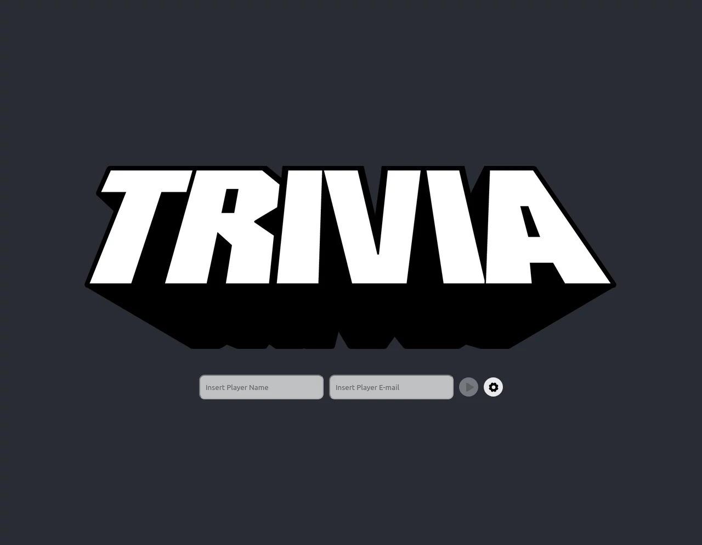
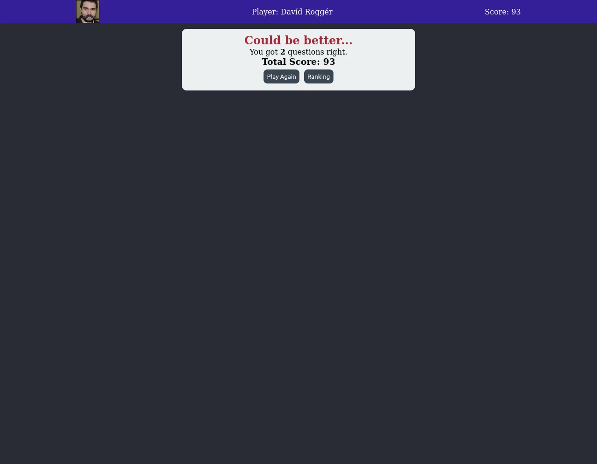

# Sobre

## Seção: `Metodologias Ágeis`

- Aqui continuamos a práticar mas em grupo aplicando colaboração e organização em grupo, para consolidar mais o uso do Redux que foi apresentado no bloco anterior.
#

  

>*clique na imagem para acesso online do projeto*
#
## Projeto: `Trivia`
- Projeto é um jogo de multipla escolha, onde inicialmente é necessário logar com um nome, e um e-mail, esse email caso seja de uma conta existente do [gravatar](https://en.gravatar.com/) utiliza a mesma imagem de avatar dele! Ao logar é gerado um token de acesso para uma API gratuita, [Open Trivia](https://opentdb.com/), onde é fornecido 5 perguntas de multipla escolha de forma aleatória, essas perguntas possuem níveis de dificuldade e com base nesse nível e o tempo de resposta, é gerado uma pontuação que na conclusão é apresentado uma mensagem padrão com feedback do seu desempenho, com sua pontuação dando acesso ao ranking dos participantes.

# Tecnologias e ferramentas usadas 🛠

# Desafios

- lore

# Conclusão

- lore

  

    <strong>
      :newspaper_roll: Requisitos solicitados durante o desenvolvimento do projeto
    </strong>
  

 
### Requisitos
*Nome* | *Avaliação*
--- | :---:
1 - [TELA DE LOGIN] Crie a tela de login, onde a pessoa que joga deve preencher as informações para iniciar um jogo | :heavy_check_mark:
2 - [TELA DE LOGIN] Crie o botão de iniciar o jogo | :heavy_check_mark:
3 - [TELA DE LOGIN] Crie um botão na tela inicial que leve para a tela de configurações | :heavy_check_mark:
4 - [TELA DE JOGO] Crie um header que deve conter as informações da pessoa jogadora | :heavy_check_mark:
5 - [TELA DE JOGO] Crie a página de jogo que deve conter as informações relacionadas à pergunta | :heavy_check_mark:
6 - [TELA DE JOGO] Desenvolva o jogo onde só deve ser possível escolher uma resposta correta por pergunta | :heavy_check_mark:
7 - [TELA DE JOGO] Desenvolva o estilo que, ao clicar em uma resposta, a correta deve ficar verde e as incorretas, vermelhas | :heavy_check_mark:
8 - [TELA DE JOGO] Desenvolva um timer onde a pessoa que joga tem 30 segundos para responder | :heavy_check_mark:
9 - [TELA DE JOGO] Crie o placar com as seguintes características: | :heavy_check_mark:
10 - [TELA DE JOGO] Crie um botão de "Next" que apareça após a resposta ser dada | :heavy_check_mark:
11 - [TELA DE JOGO] Desenvolva o jogo de forma que a pessoa que joga deve responder 5 perguntas no total | :heavy_check_mark:
12 - [TELA DE FEEDBACK] Desenvolva o header de feedback que deve conter as informações da pessoa jogadora | :heavy_check_mark:
13 - [TELA DE FEEDBACK] Crie a mensagem de feedback para ser exibida a pessoa usuária | :heavy_check_mark:
14 - [TELA DE FEEDBACK] Exiba as informações relacionadas aos resultados obtidos para a pessoa usuária | :heavy_check_mark:
15 - [TELA DE FEEDBACK] Crie a opção para a pessoa jogadora poder jogar novamente | :heavy_check_mark:
16 - [TELA DE FEEDBACK] Crie a opção para a pessoa jogadora poder visualizar a tela de ranking | :heavy_check_mark:
17 - [TELA DE RANKING] Crie um botão para ir ao início | :heavy_check_mark:
18 - [TELA DE RANKING] Crie o conteúdo da tela de ranking | :heavy_check_mark:

  

    <strong>
      :memo: Todo list
    </strong>
  

  - [x] - ~~Criar aplicação com base nos requisitos da trybe.~~ 
  - [ ] - Revisar Estilo dos elementos da página.
  - [ ] - Desenvolver testes automatizados.
  - [ ] - Adaptar elementos da aplicação para mobile.

#
## Membros:

  <a href="https://www.linkedin.com/in/alansouza1/">
    
  <a href="https://www.linkedin.com/in/carlos-pabst-prillwitz/">
    
  <a href="https://www.linkedin.com/in/davidrogger">
    
  <a href="https://www.linkedin.com/in/felipedfe/">
    
  <a href="https://www.linkedin.com/in/lucasbmonteiro/">
    

#

  

